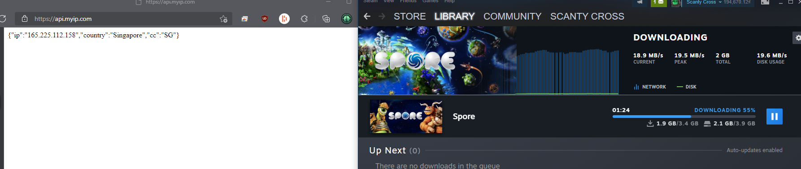

# **B*tchhiker's Guide to Bypass Đứt Cáp **
## ***Answer to Ultimate Question of Đứt Cáp Life, Vịt Héo and Something.***
Theo anh em cũng được biết, cứ đến hẹn lại lên, hoặc không cần hẹn cũng nó cũng lên như anh em mùa NNN, mạng mẽo mùa **đứt cáp** nó cứ như đáp c...à mà thôi nó thơm lắm...

Thật ra hiện trạng này bao năm qua không phải lỗi của con cá mập, không phải tội của tàu biển, không liên quan đến cọng **bún**, ý nhầm, cọng cáp quang biển. Hiện trạng này liên quan đến việc ai cũng biết mà không ai dám nhắc đến...Volder...à mà thôi, bác Rowling chém bản quyền chết.

Như đã biết, nhu cầu cày game, vào store mua game, download game của anh em nó cao như nhu cầu của anh em mùa NNN, vậy mà nó cứ đứt cáp thì làm thế nào đây. À mà NNN này không phải mùa NNN mà anh em đang nghĩ đâu nhé, nó là No-Network-November đấy.
An tâm, đã có thuốc đặc trị cho cái bệnh NNN này, một loại thuốc phổ biến mà ít anh em nào để ý đến, có để ý đến cũng ít biết dùng đúng cách. Nay mạo phép gửi anh em bài thuốc sử dụng cái loại thuốc này cho đúng cách.

Thành phần:
1. VPN chính hãng hoặc VPN tốt tùy liều dùng(69.69%)
1. Laptop hoặc PC có 2 Ethernet LAN/WiFi
1. Tá lả vừa đủ(cáp LAN có thể share ngược đường truyền, hầu hết cáp Cat5e/Cat6 loại đúc sẵn đã có thể dùng ngay, các trường hợp khác tham khảo nếu cáp của mình crossover hay không)

Chỉ định:
1. Các trường hợp download quá chậm
1. Mạng quá lag vì ping khủng
1. Không thể vào store
1. Không thể update OS

Đối tượng chỉ định:
* Máy console các thể loại bao gồm:
1. Xbox One béo phì
1. Xbox One Suy dinh dưỡng
1. Xbox One đi tìm X
1. Xbox Series Suy dinh dưỡng
1. Xbox Series nghiện X

Chống chỉ định:
* Mẫn cảm với cách thành phần của thuốc

Liều dùng:
1. Kết nối mạng chính vào Laptop/PC
1. Mở kết nối VPN sang Singapore/Hongkong/Korea để có kết nối ổn định nhất(chống chỉ định North Korea, nguy cơ kích hoạt tự hủy khá cao)
1. Mở Start menu, search View Network Connections hoặc mở Control Panel\Network and Internet\Network Connections
1. Trên cửa sổ Networks lúc này sẽ có khá nhiều icons, cần chú tâm vào 2 icons: icon của cổng VPN đang dùng, icon của mạng sẽ share ra(Nếu là Mobile Hotspot thì xem bước 5, không dùng Mobile Hotspot thì bỏ qua bước 5 )
1. Mở kết nối Mobile Hotspot để share network ra Wifi(có thể đổi tên hotspot và password tùy ý), ở cửa sổ Networks sẽ thấy thêm 1 LAN connection có label MS Wi-Fi Direct Virtual Adapter.
1. Chuột phải vào icon kết nối của VPN(sẽ có label của tên VPN), chọn Properties.
1. Mở sang tab Sharing, tick chọn "Allow other network users to connect through..."
1. Ở drop box Home network connection, chọn cổng network đang share mạng(nếu wifi hotspot thì dùng cổng ở bước 5, nếu dùng cáp LAN thì dùng cổng LAN Ethernet)
1. Click OK, có thể sẽ có popup phụ, cứ click OK tiếp để share mạng ra.
1. Nếu share qua mạng LAN, cắm cáp vào máy console. Nếu share qua Wifi, kết nối console vào wifi vừa share.
1. Dùng Web-browser để mở https://api.myip.com/ để xem IP đã đổi chưa, nếu IP vẫn là VN thì làm lại từ đầu.(Nếu dùng Mobile Hotspot có thể dùng điện thoại để test)
1. Test MS Store và download lúc này sẽ không đáp c...à nhầm...đứt cáp.

***Lưu ý phản ứng thuốc: NAT Type lúc này sẽ Strict hoặc Double nhưng nó sẽ chỉ ảnh hưởng duy nhất Inbound vào máy như remote, các chức năng online khác ổn định kể cả chơi online. Tuy nhiên kết nối còn phụ thuộc vào máy đang share network(ví dụ mất wifi, hết pin, mất điện, crash máy). Speedtest.net sẽ cho ra kết quả giả, người bệnh không cần quan tâm đến kết quả này.***

**Đã kiểm nghiệm lâm sàng trên Xbox One X sử dụng Mobile Hotspot và Ethernet LAN/PC Download MS Store và Steam, kết quả cho thấy số thử nghiệm không có phản ứng thuốc diện nguy kịch. số ít phản ứng nhẹ có thể tự khỏi, kết quả điều trị có hiệu quả cao. Thành phần thuốc thử nghiệm sử dụng bao gồm ZScaler/Hotspot Shield/Dashlane/Freedom/Peer2Peer-VPNGate/ và một số thành phần đặc trị theo yêu cầu riêng.**

**Đính kèm kết quả thử nghiệm lâm sàng gửi các cơ quan kiểm duyệt trước và sau khi sử dụng thuốc.**

